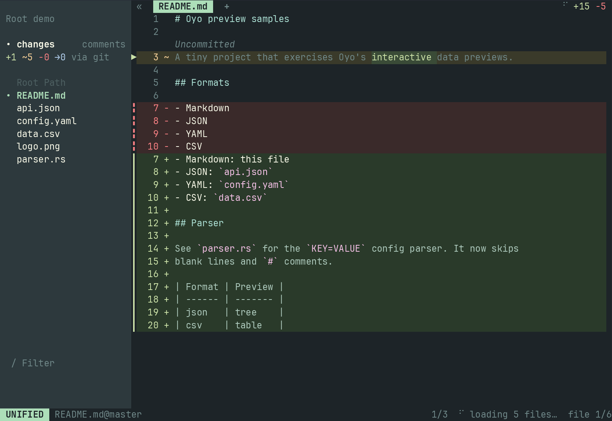

<div align="center">

# Oyo

Oyo is your complete terminal code review tool.

<!-- Regenerate with: cd website && npm run generate-demos -->


</div>

> Oyo is under active development. Expect rough edges and bugs in current 0.1 releases. Feel free to [open an issue](https://github.com/ahkohd/oyo/issues/new).

Read any change, comment on exact lines and work every thread through to resolved. Oyo keeps the whole review in your terminal.

Diff viewing is how you read a change. Oyo also stores comments, tracks replies, syncs review threads and gives agents the same workflow.

## Code review for you, your team and your agent

### Review any change

Review a working tree, branch, commit, range, jj change or stack. Add comments to lines and hunks, reply in threads and resolve feedback.

Oyo saves each review against its target. You can close the TUI and continue later.

### Sync with your team

Pull review comments from GitHub, GitLab, Codeberg or self-hosted Forgejo. Reply and push changes back. GitHub and GitLab also support remote thread resolution. Forgejo resolved state is read-only because its API has no resolve endpoint.

### Work with your agent

Point your coding agent at the Oyo skill. The agent can review a change, leave comments, work through feedback or control a running Oyo session.

Humans and agents use the same targets, comments and commands. See [working with agents](./docs/AGENT.md).

## Choose how you read a change

You can switch between scroll mode and step mode at any time.

### Scroll mode

Use scroll mode to read the whole change at once. You can scroll freely and jump between hunks.

```sh
oy
```

### Step mode

Use step mode to read one edit at a time. You can also press play to move through the change automatically.

```sh
oy --step
```

Press `s` in the TUI to switch modes. Set `stepping = true` in your config to start in step mode.

## Features

Oyo helps you complete a review without leaving the terminal. You can:

- comment on lines, hunks and files
- reply in flat review threads
- resolve and reopen thread roots
- track comments that become outdated as the diff changes
- pull, reply to and push GitHub, GitLab, Codeberg and self-hosted Forgejo review comments
- use the review CLI and installed skill with coding agents
- read changes in scroll mode or step mode
- move between hunks and files
- find reviewed files with typo-tolerant path search
- find text in changed lines or complete reviewed file content
- switch between unified, split, evolution, blame and preview views
- open multiple views in tabs
- preview Markdown, JSON, YAML, TOML, CSV and images
- select and copy text with character, line and block selection
- see word-level changes
- search with regular expressions
- use syntax highlighting and `.tmTheme` syntax themes
- fold unchanged context with enclosing scope hints
- show blame hints
- refresh changed files in watch mode
- run commands from the command palette
- use keyboard and mouse controls
- animate or autoplay changes in step mode
- wrap long lines
- review Git and jj targets
- open saved review history with `oy log`
- run review hooks
- load configuration from XDG config paths

## Install

### npm

```sh
npm i -g @ahkohd/oyo
```

### Pi package

The Pi package adds the `/oyo` command. It points the coding agent at the Oyo review, walkthrough and control skills.

```sh
pi install npm:@ahkohd/pi-oyo
```

### Homebrew

```sh
brew install ahkohd/oyo/oy
```

### Arch Linux

```sh
paru -S oyo
```

### Cargo

```sh
cargo install oyo --locked --force
```

### Nix

```sh
nix profile add github:ahkohd/oyo
```

Or run it without installing:

```sh
nix run github:ahkohd/oyo
```

## Use Oyo

### Show uncommitted changes

```sh
oy
```

### Step through uncommitted changes

```sh
oy --step
```

### Compare 2 files

```sh
oy old.rs new.rs
```

### Compare one file with HEAD

```sh
oy path/to/file.rs
```

### Show staged changes

```sh
oy --staged
```

### Show a Git range

```sh
oy --range HEAD~1..HEAD
oy --range main...feature
```

### Choose a view mode

```sh
oy old.rs new.rs --view split
oy old.rs new.rs --step --view evolution
```

### Use autoplay

```sh
oy old.rs new.rs --step --autoplay
oy old.rs new.rs --step --speed 100
```

### Open history

```sh
oy log
```

## Use Oyo with Git

Use `git difftool`:

```sh
git difftool -y --tool=oy
```

Add this configuration to `~/.gitconfig`:

```gitconfig
[difftool "oy"]
    cmd = oy "$LOCAL" "$REMOTE"

[difftool]
    prompt = false

[alias]
    d = difftool -y --tool=oy
```

Keep your pager, such as `less`, `moar` or `moor`, for `git diff`.

Do not set `core.pager` or `interactive.diffFilter` to `oy`.

## Use Oyo with Jujutsu

Register `oy` as a diff tool and add a shortcut:

```toml
[merge-tools.oy]
program = "oy"
diff-args = ["$left", "$right"]

[aliases]
d = ["diff", "--tool", "oy"]
```

Run `jj d` or `jj diff --tool oy`.

You can also open jj targets directly:

```sh
oy @
oy feature
oy 'trunk()..@'
```

Keep your pager for `jj diff`, `jj log` and other commands. Do not set `oy` as the global `ui.diff-formatter`.

## Review comments

Press `m` to comment on a line. Press `M` to comment on a hunk.

```sh
oy
```

Oyo saves review state for the current target. Review cards use indexed actions:

- `ra` replies to the first visible comment
- `va` resolves or reopens the first visible thread root
- `ia` edits the first visible comment
- `xa` deletes the first visible comment

The index changes to `b`, `c` and later letters for other visible cards. Reply cards do not show a resolve action because resolved state belongs to the thread.

Every review action also has a CLI command. This means you and your agent can work on the same review:

```sh
oy review status
oy review status --json
oy review comment
oy review comment --unresolved
oy review comment new --file src/lib.rs --new-line 42 --body "Handle empty input."
oy review comment reply 1 --body "Fixed in the latest change."
oy review comment resolve 1
oy review comment unresolve 1
```

The `--unresolved` filter hides outdated comments by default. Oyo marks a comment outdated when its anchored line changes or disappears. Use `--unresolved --outdated` to inspect stale unresolved comments.

All review commands use the same target rules. In Git, Oyo prefers the current branch's saved pull request review. It falls back to the working tree.

Use `-t @` for the Git working tree. Pass a branch, commit or range with `-t` for another review:

```sh
oy review status -t development...feature
oy review comment -t feature
```

jj defaults to `@`. If `@` has one bookmark, Oyo treats that bookmark like a branch.

Use a jj revset to review a stack:

```sh
oy 'trunk()..@'
oy review comment 'trunk()..@'
```

Pull and push provider review comments after authenticating `gh`, `glab`, `cb` or `fj` for the remote host:

```sh
oy review pull
oy review push
```

Export comments or apply review JSON:

```sh
oy review export --format json > comments.json
oy review comment apply comments.json
```

See the [review command reference](./docs/REVIEW.md), [agent workflows](./docs/AGENT.md) and [review hooks](./docs/REVIEW_HOOKS.md).

## Keybindings

Most navigation commands support counts. For example, `10j` moves 10 steps forward and `5J` scrolls down 5 lines.

Common defaults:

| Key | Action |
| --- | --- |
| `j`, `down` | Scroll down, or next step in step mode |
| `k`, `up` | Scroll up, or previous step in step mode |
| `l`, `right` | Next hunk |
| `h`, `left` | Previous hunk |
| `v` | Start character selection |
| `V` | Start line selection |
| `ctrl-v` | Start block selection |
| `y` | Copy selection or current line |
| `/` | Search |
| `n` | Next search match |
| `N` | Previous search match |
| `tab` | Cycle view modes |
| `s` | Toggle step mode |
| `m` | Add or update a line comment |
| `M` | Add or update a hunk comment |
| `ctrl-s` | Save an inline comment |
| `ctrl-p` | Open the command palette |
| `ctrl-shift-f` | Search content across reviewed files |
| `R` | Refresh files |
| `?` | Show help |
| `q` | Quit |

See the [keybinding and mouse reference](./docs/KEYBINDINGS.md).

Select text with a mouse drag or `v`, `V` and `ctrl-v`. Press `y` to copy and `esc` to clear.

Oyo first uses a system clipboard tool:

- `pbcopy` on macOS
- `wl-copy`, `xclip` or `xsel` on Linux
- `clip` on Windows

Oyo falls back to OSC 52 clipboard support if these tools fail.

## Configure Oyo

Create `~/.config/oyo/config.toml`.

You can pass extra config files with repeatable `--config FILE` options. Oyo loads your user config first, then merges each extra file in order.

```sh
oy --config /tmp/oyo-plugin.toml
```

A minimal configuration looks like this:

```toml
[ui]
view_mode = "unified"
stepping = false
watch = true
line_wrap = false

[ui.diff]
fg = "syntax"
bg = true
highlight = "word"

[ui.syntax]
mode = "on"

[files]
panel_visible = true
panel_width = 30
panel_position = "left"
```

Oyo loads the first matching user config file:

1. `$XDG_CONFIG_HOME/oyo/config.toml`
2. `~/.config/oyo/config.toml`
3. the platform config directory, such as `~/Library/Application Support/oyo/config.toml` on macOS

Use these references for more configuration:

- [config reference](./docs/CONFIG.md)
- [theme configuration](./docs/THEME.md)
- [keybinding actions](./docs/KEYBINDINGS.md)
- [review commands](./docs/REVIEW.md)
- [review hooks](./docs/REVIEW_HOOKS.md)
- [diff behaviour](./docs/DIFF_VIEWER.md)
- [diff styling previews](./docs/DIFF_PREVIEWS.md)

The [diff styling previews](./docs/DIFF_PREVIEWS.md) include screenshots.

## Development

```sh
cargo build
cargo test
cargo run --bin oy -- old.rs new.rs
```
