# Diff configuration previews

Use these previews to choose diff display settings.

Each example shows the TOML you need for `[ui.diff]`, followed by a screenshot.

## Theme foreground

Use `fg = "theme"` to colour diff text with the UI theme.

### Theme foreground without line backgrounds

#### No inline highlight

```toml
[ui.diff]
fg = "theme"
bg = false
highlight = "none"
```

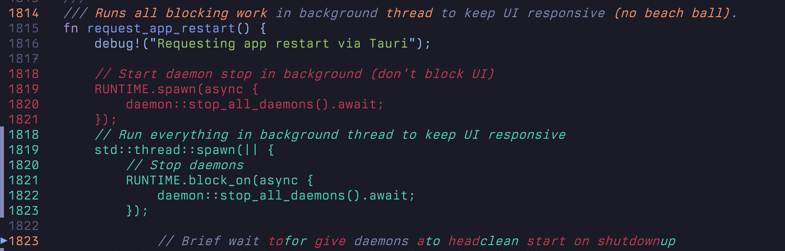

#### Word highlight

```toml
[ui.diff]
fg = "theme"
bg = false
highlight = "word"
```

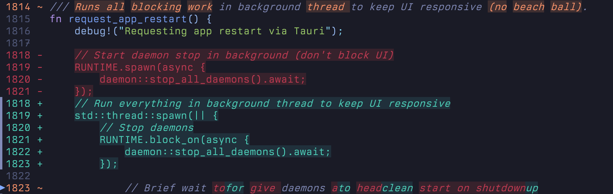

#### Text highlight

```toml
[ui.diff]
fg = "theme"
bg = false
highlight = "text"
```

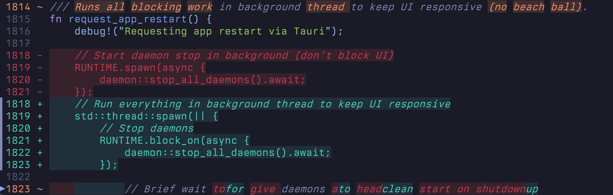

### Theme foreground with line backgrounds

#### No inline highlight

```toml
[ui.diff]
fg = "theme"
bg = true
highlight = "none"
```

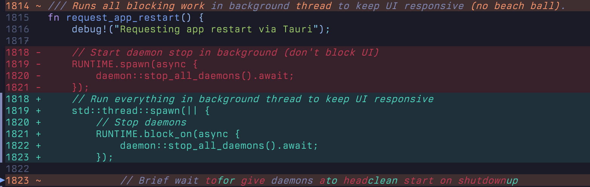

#### Text highlight

```toml
[ui.diff]
fg = "theme"
bg = true
highlight = "text"
```

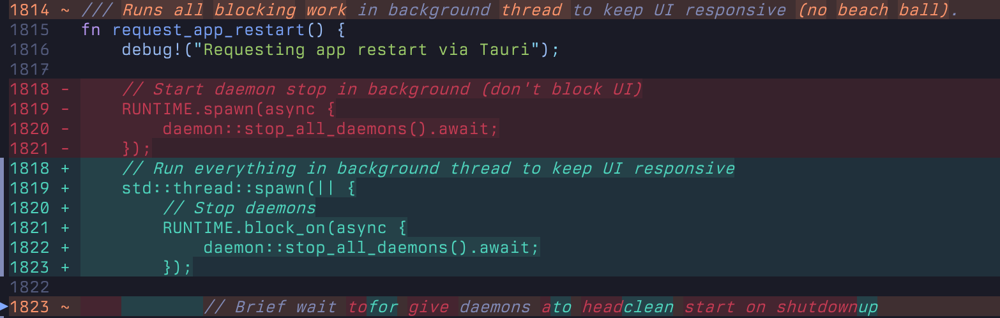

#### Word highlight

```toml
[ui.diff]
fg = "theme"
bg = true
highlight = "word"
```

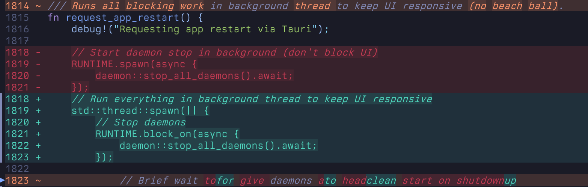

## Syntax foreground

Use `fg = "syntax"` to keep syntax colours in diff text.

### Syntax foreground without line backgrounds

#### No inline highlight

```toml
[ui.diff]
fg = "syntax"
bg = false
highlight = "none"
```

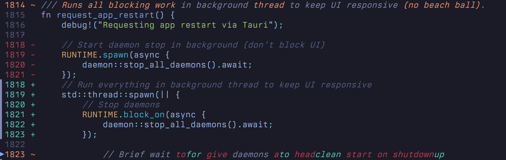

#### Text highlight

```toml
[ui.diff]
fg = "syntax"
bg = false
highlight = "text"
```

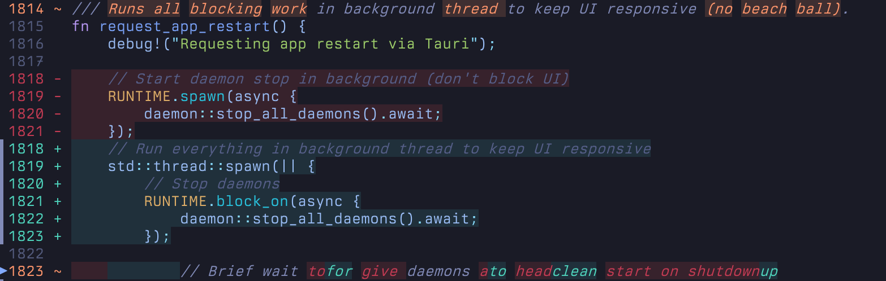

#### Word highlight

```toml
[ui.diff]
fg = "syntax"
bg = false
highlight = "word"
```


### Syntax foreground with line backgrounds

#### No inline highlight

```toml
[ui.diff]
fg = "syntax"
bg = true
highlight = "none"
```

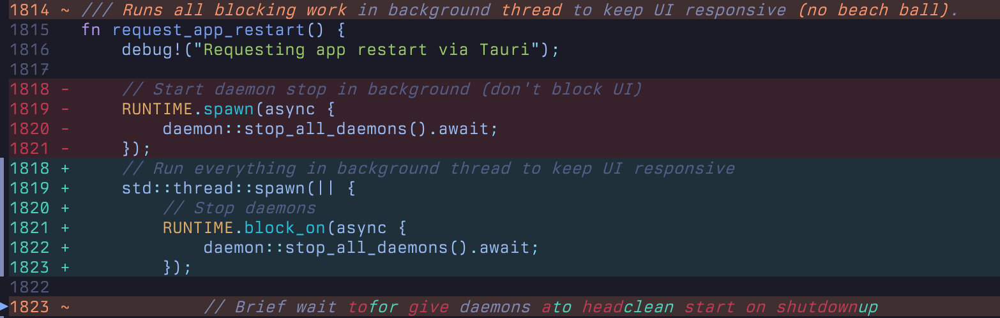

#### Text highlight

```toml
[ui.diff]
fg = "syntax"
bg = true
highlight = "text"
```

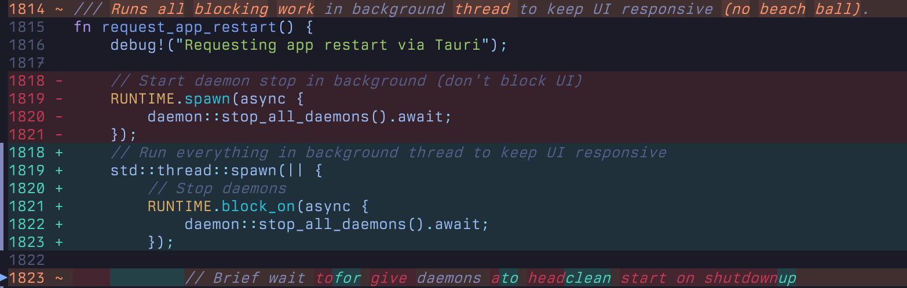

#### Word highlight

```toml
[ui.diff]
fg = "syntax"
bg = true
highlight = "word"
```

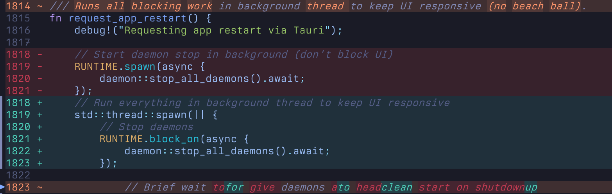

## Extent markers

Use extent markers to show the current hunk or step area.

### Diff-coloured extent marker

```toml
[ui.diff]
extent_marker = "diff"
```

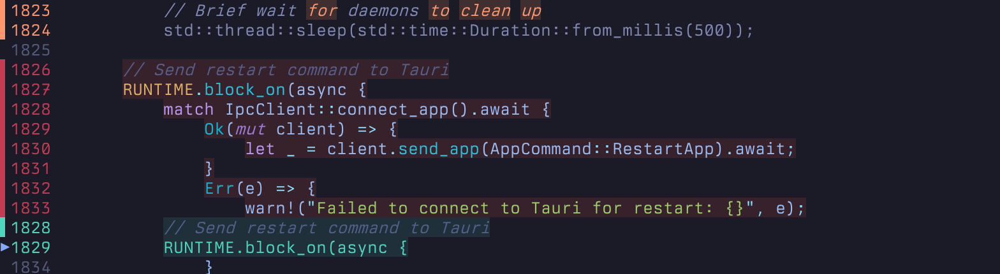

### Hunk scope

```toml
[ui.diff]
extent_marker_scope = "hunk"
```

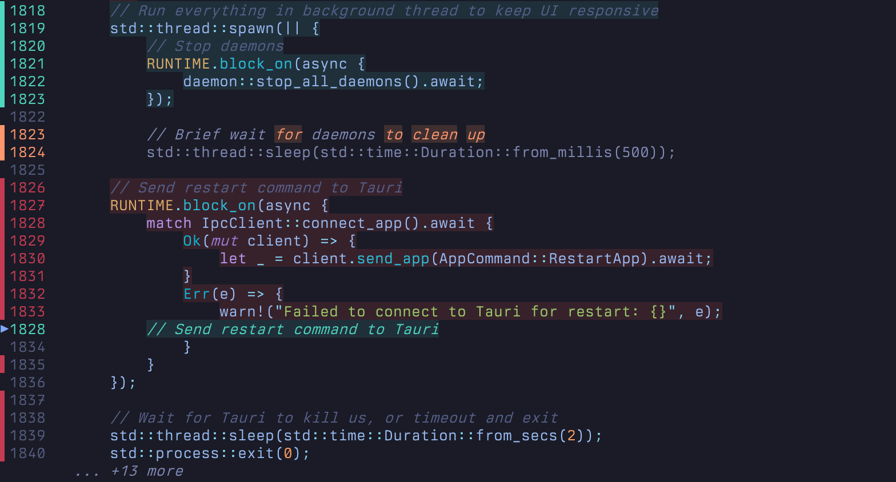

### Progress scope

```toml
[ui.diff]
extent_marker_scope = "progress"
```

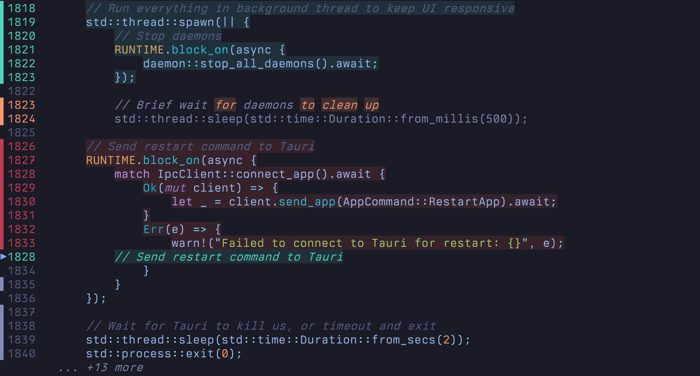

## Gutter signs

Use `gutter_signs = false` to hide the sign column in unified and evolution views.

### No line backgrounds

```toml
[ui]
gutter_signs = false

[ui.diff]
bg = false
```

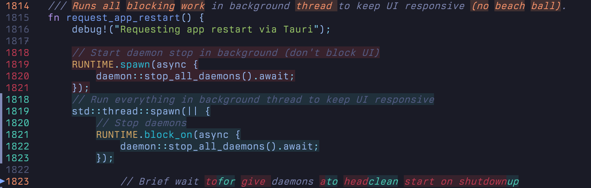

### Line backgrounds

```toml
[ui]
gutter_signs = false

[ui.diff]
bg = true
```


## Split view line alignment

Use `align_lines = true` to insert blank rows so old and new panes stay aligned.

### Without line alignment

```toml
[ui.split]
align_lines = false
```

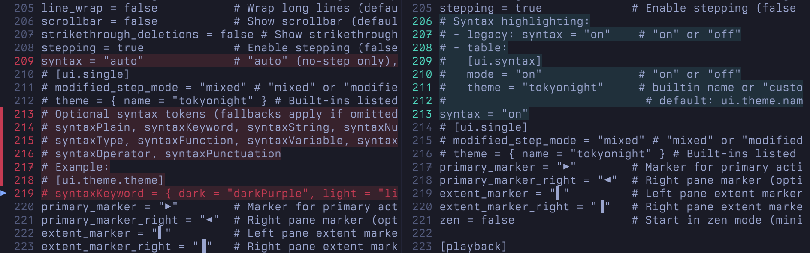

### With line alignment

```toml
[ui.split]
align_lines = true
```

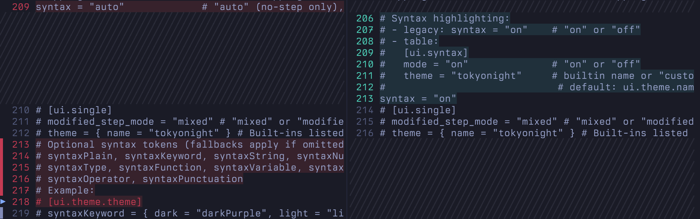

## Syntax highlighting off

Use this when you want plain diff colours without syntax highlighting.

```toml
[ui.syntax]
mode = "off"
```

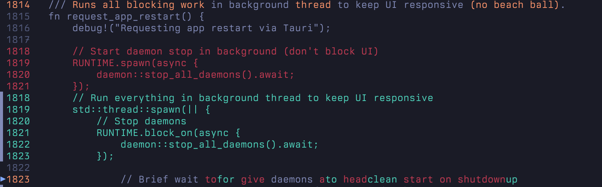
